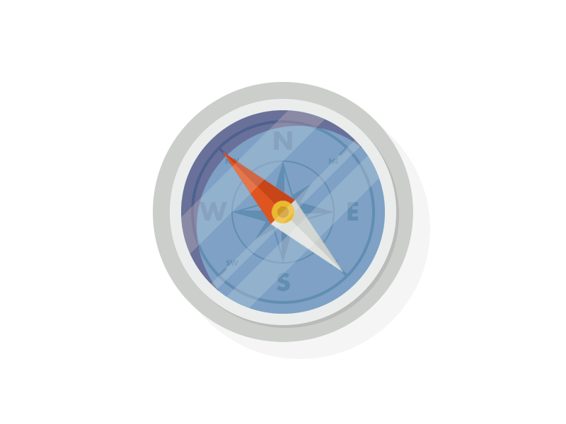

[
](https://coveralls.io/r/studio-b12/doxie)
 [
](https://travis-ci.org/studio-b12/doxie)
 [
](https://david-dm.org/studio-b12/doxie)
 [
](https://nodejs.org/api/documentation.html#documentation_stability_index)
 [
](https://github.com/airbnb/javascript)


doxie
=====

**The simplest doc generator you’ve seen.**


**⚠ Heads up!** This is totally a work in progress. [Thoughts and ideas][] are very welcome.

[Thoughts and ideas]:  https://github.com/studio-b12/doxie/issues


<p align="center"><a
  title="Graphic by the great Justin Mezzell"
  href="http://justinmezzell.tumblr.com/post/89652317743"
  >
  <br/>
  <br/>
  
  <br/>
  <br/>
</a></p>


Installation
------------

*doxie* is a command-line tool.

```sh
$ npm install --global doxie
```


*doxie* itself is just a slim core. Every feature is a plugin. So if you want to run `doxie --filter --output`, make sure you install *[doxie.filter][]* and *[doxie.output][]* first:

```sh
$ npm install --global doxie.filter doxie.output
```


Speaking of plugins, most of them are compatible with *[dox][]*

```sh
$ npm install --global dox
```


[doxie.filter]:  http://npm.im/doxie.filter
[doxie.output]:  http://npm.im/doxie.output
[dox]:           http://npm.im/dox


Usage
-----

…


License
-------

[MIT][] © [Studio B12 GmbH][]

[MIT]:              ./License.md
[Studio B12 GmbH]:  http://www.studio-b12.de
